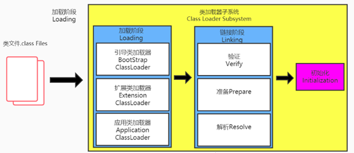

# Java面试题按类别总结(2020.10.07)
## 1、Java基础
1.1 equals和==区别(null哪个能用), 如果没有重写equals方法,那么a==b和a.equals(b)一样吗(2020字节提前批)

equals(): 方法
1. 是一个方法，而非运算符
2. 只能适用于引用数据类型
3. Object类中equals()的定义：
    public boolean equals(Object obj) {
	        return (this == obj);
	  }
* 说明：Object类中定义的equals()和==的作用是相同的：比较两个对象的地址值是否相同.即两个引用是否指向同一个对象实体

4. 像String、Date、File、包装类等都重写了Object类中的equals()方法。重写以后，比较的不是两个引用的地址是否相同，而是比较两个对象的"实体内容"是否相同。  
5. 通常情况下，我们自定义的类如果使用equals()的话，也通常是比较两个对象的"实体内容"是否相同。那么，我们就需要对Object类中的equals()进行重写.重写的原则：比较两个对象的实体内容是否相同.

== ：运算符
1. 可以使用在基本数据类型变量和引用数据类型变量中
2. 如果比较的是基本数据类型变量：比较两个变量保存的数据是否相等。（不一定类型要相同）
+ 如果比较的是引用数据类型变量：比较两个对象的地址值是否相同.即两个引用是否指向同一个对象实体
+ 补充： == 符号使用时，必须保证符号左右两边的变量类型一致。

所以, ==可以判断对象为null, equals()不能, 如果该类没有重写equals方法, 则使用Object类的equals的方法, 而Object中的equals使用就是==判断

1.2 hashcode和equals(2020字节提前批) 

1.3 创建线程的方法及区别(2020字节提前批) 

1.4 try catch能捕获到哪些异常(2020字节提前批) 

1.5 重载和重写的区别(2020招银网络提前批) 
① 概念

重载:同一个类中,相同的方法名;不同的参数列表,包括不同的参数类型和不同的参数个数

重写:子类继承父类以后，可以对父类中同名同参数的方法，进行覆盖操作.
重写以后，当创建子类对象以后，通过子类对象调用子父类中的同名同参数的方法时，实际执行的是子类重写父类的方法。

② 重载和重写的规则

③ 重载: 不表现为多态性 
重写: 表现为多态性

重载，是指允许存在多个同名方法，而这些方法的参数不同。编译器根据方法不同的参数表，对同名方法的名称做修饰。对于编译器而言，这些同名方法就成了不同的方法。它们的调用地址在编译期就绑定了。Java的重载是可以包括父类和子类的，即子类可以重载父类的同名不同参数的方法。
所以：对于重载而言，在方法调用之前，编译器就已经确定了所要调用的方法，这称为“早绑定”或“静态绑定”；
而对于多态，只等到方法调用的那一刻，解释运行器才会确定所要调用的具体方法，这称为“晚绑定”或“动态绑定”。

1.6 static和final会被重写吗(2020招银网络提前批) 
***final***
1. final 用来修饰一个类:此类不能被其他类所继承。比如：String类、System类、StringBuffer类 
2. final 用来修饰方法：表明此方法不可以被重写比如：Object类中getClass() 
3. final 用来修饰变量：此时的"变量"就称为是一个常量 
4. final修饰属性：可以考虑赋值的位置：显式初始化、代码块中初始化、构造器中初始化
5. final修饰局部变量：尤其是使用final修饰形参时，表明此形参是一个常量。当我们调用此方法时，给常量形参赋一个实参。一旦赋值以后，就只能在方法体内使用此形参，但不能进行重新赋值。       
> static final 用来修饰属性：全局常量 

***static*** 
static修饰属性：静态变量（或类变量）
1. 属性，是否使用static修饰，又分为：静态属性  vs 非静态属性(实例变量) 
2. 实例变量：我们创建了类的多个对象，每个对象都独立的拥一套类中的非静态属性。当修改其中一个对象中的非静态属性时，不会导致其他对象中同样的属性值的修改。 
静态变量：我们创建了类的多个对象，多个对象共享同一个静态变量。当通过某一个对象修改静态变量时，会导致其他对象调用此静态变量时，是修改过了的。 
3. static修饰属性的其他说明： 
 ① 静态变量随着类的加载而加载。可以通过"类.静态变量"的方式进行调用 
 ② 静态变量的加载要早于对象的创建。 
 ③ 由于类只会加载一次，则静态变量在内存中也只会存在一份：存在方法区的静态域中。 

|  |类变量|实例变量|
|:----:|:----:|:----:|
|类|yes|no|
|对象|yes|yes|
 

static修饰方法：静态方法、类方法 
1. 随着类的加载而加载，可以通过"类.静态方法"的方式进行调用

2.
|  |静态方法|非静态方法|
|:----:|:----:|:----:|
|类|yes|no|
|对象|yes|yes|

3. 静态方法中，只能调用静态的方法或属性非静态方法中，既可以调用非静态的方法或属性，也可以调用静态的方法或属性
4. 静态属性举例：System.out; Math.PI;

1.7 string三姐妹(2020招银网络提前批) 
String(JDK1.0)不可变的字符序列; 底层使用final char[]存储 
StringBuffer(JDK1.0)可变的字符序列;线程安全的, 效率低; 底层使用transient char[]存储 
StringBuilder(JDK1.5)可变的字符序列；jdk5.0新增的，线程不安全的，效率高；底层使用char[]存储 
***String:字符串, 使用一对""引起来表示*** 
1.String声明为final的，不可被继承 
2.String实现了Serializable接口：表示字符串是支持序列化的。实现了Comparable接口：表示String可以比较大小 
3.String内部定义了final char[] value用于存储字符串数据 
4.通过字面量的方式（区别于new给一个字符串赋值，此时的字符串值声明在字符串常量池中) 
5.字符串常量池中是不会存储相同内容(使用String类的equals()比较，返回true)的字符串的 

***不可变性的说明*** 
1.当对字符串重新赋值时，需要重写指定内存区域赋值，不能使用原有的value进行赋值。 
2.当对现的字符串进行连接操作时，也需要重新指定内存区域赋值，不能使用原有的value进行赋值。 
3.当调用String的replace()方法修改指定字符或字符串时，也需要重新指定内存区域赋值，不能使用原有的value进行赋值。 

关于可变性的扩容问题 
扩容问题:如果要添加的数据底层数组装不下了，那就需要扩容底层的数组。默认情况下，扩容为原来容量的2倍 + 2，同时将原数组中的元素复制到新的数组中。 

1.8 逻辑与的短路原则, &&如果前面为false，后面如果有空指针语句，会不会报异常(2020招银网络提前批) 

1.9 类的生命周期(2020招银网络提前批) 

1.10 说说你理解的反射，应用在哪(可以往Spring框架上说)(2020招银网络提前批) 

1.11 arraylist，linkedlist，hashset区别和使用场景，线程安全(2020京东提前批) 

1.12 new子类的时候，子类和父类静态代码块，构造器的执行顺序(2020京东提前批) 

1.13 runnable和callable区别(2020京东提前批) 

1.14 用过序列化和反序列化吗(2020京东提前批) 

1.15 内存泄露的场景(2020招行总行提前批) 

1.16 说一下hashmap实现, 线程安全的hashmap(2020新浪微博提前批) 

## 2、JVM
> 2.1 类加载过程和双亲委派机制(2020字节提前批) 

类加载过程: 加载(loading)=>链接(验证->准备->解析)=>初始化

***加载阶段***
1. 通过一个类的全限定名获取定义此类的二进制字节流
2. 将这个字节流所代表的静态存储结构转化为方法区的运行时数据结构
3. 在内存中生成一个代表这个类的java.lang.Class对象，作为方法区这个类的各种数据的访问入口

***链接阶段***
1. 验证
* 目的在于确保Class文件的字节流中包含信息符合当前虚拟机要求, 保证被加载类的正确性, 不会危害虚拟机自身安全
* 主要包括四种验证: 文件格式验证, 元数据验证, 字节码验证, 符号引用验证
> 使用BinaryViewer查看字节码文件，其开头均为 CAFE BABE ，如果出现不合法的字节码文件，那么将会验证不通过

2. 准备
* 为类变量分配内存并且设置类变量的默认初始值, 即零值
* 这里不包含用final修饰的static, 因为final在编译的时候就会分配了, 准备阶段会显示初始化.
* 这里不会为实例变量分配初始化, 类变量会分配在方法区中, 而实例变量会随着对象一起分配到Java堆中。
3. 解析
* 将常量池内的符号引用转换为直接引用的过程.
* 事实上, 解析操作往往会伴随着JVM在执行完初始化之后再执行.
* 符号引用就是一组符号来描述所以引用的目标。符号引用的字面量形式明确定义在《Java虚拟机规范》的Class文件格式中。直接引用就是直接指向目标的指针、相对偏移或一个间接定位到目标的句柄。
* 解析的主要针对类或接口、字段、类方法、接口方法、方法类型等。对应常量池中的CONSTANT_Class_info、CONSTANT_Fieldref_info、CONSTANT_Methodref_info等

***初始化阶段***

1. 初始化阶段就是执行类构造器方法\<clinit>()的过程
2. 此方法不需定义，是javac编译器自动收集类中的所有类变量的赋值动作和静态代码块中的语句合并而来。也就是说，当我们代码中包含static变量的时候，就会有\<clinit>()方法
3. \<clinit>()方法中的指令按语句在源文件中出现的顺序执行
4. \<clinit>()不同于类的构造器(关联：构造器是虚拟机视角下的\<init>())
5. 若该类具有父类，JVM会保证子类的\<clinit>()执行前，父类的\<clinit>()已经执行完毕
6. 虚拟机必须保证一个类的\<clinit>()方法在多线程下被同步加锁,即：一个类只会被类的加载器加载一次
> 2.2 新生代和老年代都用什么算法(2020字节提前批) 

> 2.3 jvm内存模型;堆的划分,垃圾回收算法(2020字节提前批) 

> 2.4 锁升级有哪些变化(2020招银网络提前批) 

> 2.5 锁升级有哪些变化? 自动升级的条件是什么?还是会自璇多少次或者其等待线程超过多少就升级?(2020招银网络提前批) 

> 2.6 CAS怎么解决ABA问题(2020招银网络提前批) 

> 2.7 双亲委派模型好处(2020京东提前批) 

## 3、多线程与高并发
> 3.1 synchronized(作用在哪些位置)和lock的原理及区别(2020字节提前批) 

> 3.2 描述一下乐观锁和悲观锁及其原理;synchronized和lock是乐观还是悲观及ABA问题(2020字节提前批) 

> 3.3 进程线程协程区别和联系(2020招银网络提前批) 

> 3.4 线程池核心参数(2020招银网络提前批) 

> 3.5 ThreadLocal原理, 同时引出内存泄露(2020京东提前批) 

## 4、Spring框架
> 4.1 说说依赖注入和ioc(控制反转)(2020字节提前批) 

> 4.2 说说aop(应用场景和注解)(Aspect Oriented Programming)(2020字节提前批) 

> 4.3 说一下动态代理(jdk和cglib), 同时说一下静态代理和动态代理区别(2020字节提前批)

## 5、设计模式
> 5.1 单例模式(2020字节提前批) 

> 5.2 设计模式的七大原则(2020招银网络提前批) 

> 5.3 适配器模式(2020招银网络提前批)

## 6、计算机网络
> 6.1 http和https区别及https请求过程(2020字节提前批) 

> 6.2 说一下加密算法(2020字节提前批) 

> 6.2 dns解析过程(2020字节提前批) 

> 6.3 TCP和UDP区别, tcp拥塞控制(2020招银网络提前批) 

> 6.4 tcp三次握手四次挥手工作在哪一层(2020京东提前批) 

## 7、计算机操作系统(Linux)
> 7.1 页面置换算法(2020字节提前批) 

> 7.2 LRU缓存，让我设计LRU思路(2020字节提前批)

## 8、Mysql数据库(包括缓存技术Redis和MQ消息队列)
> 8.1 索引作用及索引的数据结构B和B+树(2020字节提前批) 

> 8.2 聚簇索引是什么; innodb是什么索引(2020字节提前批) 

> 8.3 MySQL有几种搜索引擎，区别(2020招银网络提前批) 

> 8.4 数据库查询比较慢, 怎么排查? (说了explain，sql语句优化，分库分表，用redis)(2020招银网络提前批) 

> 8.5 redis分布式锁(2020招银网络提前批) 

> 8.6 如何保证redis和数据库一致性?(答:延时双删)(2020京东提前批) 

> 8.7 解释一下幻读, 事务特性及隔离级别(2020京东提前批) 

> 8.8 mysql主从复制的同步方式有几种(2020招行总行提前批) 

> 8.9 char和varchar区别(2020招行总行提前批) 

> 8.10 Innodb引擎的特点(2020新浪微博提前批) 

## 9、手撕代码
> 9.1 生产者消费者模型(2020字节提前批) 

> 9.2 判断两个链表是否相交(2020字节提前批) 

> 9.3 判断一个链表是否有环，求出入环节点; 如果链表是有环的，那如何求两链表的相交节点 

> 9.4 链表反转(2020京东提前批) 

> 9.5 二分法找排序数组中绝对值最小的元素(2020京东提前批) 